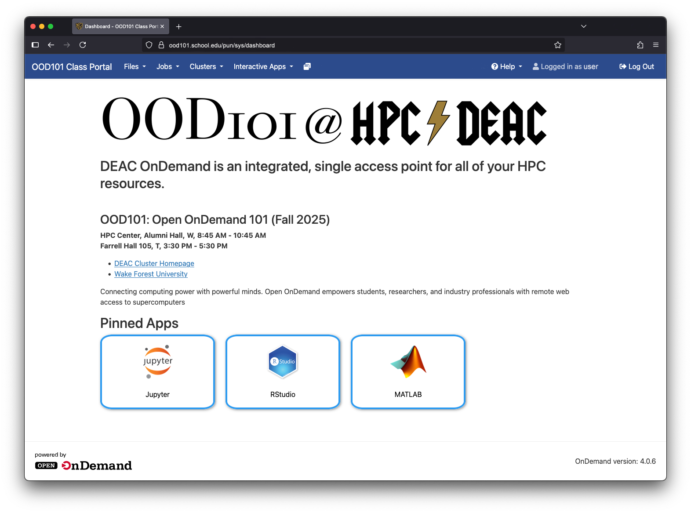

# Custom Class Portals in Open OnDemand

WFU HPC Team (deac-help@wfu.edu)<br>
Primary Contact: Sean Anderson (anderss@wfu.edu)

<p align="center">

</p>

Want to deliver more customized portals tailored for classes, departments, and research groups? Open OnDemand makes it easy using Profiles!

[Host-based profiles](https://osc.github.io/ood-documentation/latest/customizations.html#automatic-profile-selection) enable you to serve specific content for different domains. For example, you could have `bio254.school.edu`, `econ.school.edu`, and `feynmanlab.school.edu` each with their own OOD dashboard, all on the same OOD instance!

In this example, will be creating a portal for a (sadly) fictional OOD101 class.


## OOD Configuration File

You will need to edit an [OOD configuration file](https://osc.github.io/ood-documentation/latest/reference/files/ondemand-d-ymls.html) to enable the host-based profiles. This is done by adding the following option to the file:

```yaml
host_based_profiles: true
```

The easiest place to add this option is in [your main configuration file](https://osc.github.io/ood-documentation/latest/reference/files/ondemand-d-ymls.html), which may be `/etc/ood/config/ondemand.d/ondemand.yml`. You can always create a new file in `/etc/ood/config/ondemand.d/`if desired.

Either way, restart your PUN for the change to take effect.


## OOD Portal File

You will need to add the desired domains as aliases in the [OOD portal configuration file](https://osc.github.io/ood-documentation/latest/reference/files/ood-portal-yml.html), `/etc/ood/config/ood_portal.yml`. You need to add each alias to the `server_aliases` entry, like this:

```yaml
# The server name used for name-based Virtual Host
# Example:
#     servername: 'www.example.com'
# Default: null (don't use name-based Virtual Host)
servername: login.school.edu

# The server aliases used for the name-based Virtual Host
# Example:
#     server_aliases:
#       - foo.example.com
server_aliases:
  - login.school.edu
  - bio254.school.edu
  - econ.school.edu
  - feynmanlab.school.edu
  - ood101.school.edu # <-- added our new alias here
```

If you use an OpenID Connect (OIDC) authentication provider, you will probably need to add each alias to your "Authorized redirect URIs". Each provider will have a different interface; read their documentation carefully and add in each domain as needed.

**WARNING**: You will need to restart Apache which may be impactful for all logged in users:

```sh
sudo systemctl restart httpd
sudo systemctl restart htcacheclean
```

Lastly, restart your local PUN to finalize the changes.


## Creating the Profile

The profile configuration consists of 3 files, located in the `ood101` directory. A description of each file is included below.


### File 1: `profile-ood101.yml`

This file defines the look and feel of the new portal. For host-based profiles, the profile must be named the same as the domain (`ood101.school.edu`). Determine what apps you want to include, the layout, name, etc. This is also where we include the HTML widget described in the next section.

<details><summary>Expand this to see the contents of the file.</summary>

```yml
profiles:
  ood101.school.edu: &ood101_profile
    dashboard_title: "OOD101 Class Portal"
    brand_bg_color: "#2c4b8c"
    dashboard_logo: "/public/logo-ood101.png"
    pinned_apps:
      - "sys/jupyter"
      - "sys/rstudio"
      - "sys/matlab"
    pinned_apps_group_by:
    dashboard_layout:
      rows:
        - columns:
          - width: 12
            widgets:
              - widget_ood101
        - columns:
          - width: 12
            widgets:
              - pinned_apps
    announcement_path:
      - "/etc/ood/config/announcements.d/ood101.md"
```

</details><br>

Check out [the official OOD documentation](https://osc.github.io/ood-documentation/latest/reference/files/ondemand-d-ymls.html#configuration-properties-with-profile-support) for a complete list of all available options. **Any value that you do not specify in the new profile, will default to the value in the main profile.** For example, you set your main dashboard to have a black dashboard background (`brand_bg_color`); if you do not set a background color for your new profile, it will simply default to black.


### File 2: `_widget_ood101.html.erb`

The widget is an HTML file that is infinitely customizable. You can include text and links, ember videos, images, or even a Google Drive widget, and much more. We will keep it simple for this example and simply include some text and links. Read about custom widgets on [the official OOD docs](https://osc.github.io/ood-documentation/latest/customizations.html#custom-layouts-in-the-dashboard).

<details><summary>Expand this to see the contents of the file.</summary>

```html
<h3>OOD101: Open OnDemand 101 (Fall 2025)</h3>

<p>
<b>HPC Center, Alumni Hall, W, 8:45 AM - 10:45 AM</b><br>
<b>Farrell Hall 105, T, 3:30 PM - 5:30 PM</b><br>
</p>

<ul>
<li><a href="https://hpc.wfu.edu" target="_blank">DEAC Cluster Homepage</a></li>
<li><a href="https://wfu.edu" target="_blank">Wake Forest University</a></li>
</ul> 

<p>Connecting computing power with powerful minds. Open OnDemand empowers students, researchers, and industry professionals with remote web access to supercomputers</p>
```

</details>


### File 3: `logo-ood101.png`

Lastly, you need to have a nice logo for your new portal. Your users will really appreciate a design that speaks to them! Below is the simple design used for this OOD101 class example.

<p align="center">

</p>

**BONUS: Imagemagick Fun**

<details><summary>If you use imagemagick (you should), here is a single command to composite the course name onto an existing logo.</summary>

```sh
magick \
    "images/LOGO_HPC.png" \
       -background Transparent \
       -gravity East \
       -extent 3800x520 \
       -font Bodoni-72-Smallcaps-Book \
       -fill black \
       -pointsize 500 \
       -gravity NorthWest \
       -draw 'text 0,-75 "OOD101"' \
       -pointsize 350 \
       -gravity Center \
       -draw 'text 0,0 "@"' \
    "ood101/logo-ood101.png"
```

</details>
<br><br>

### Putting it all Together

Now that you have your three files, you just need to put them on your OOD server. Following the same order as above:

- `profile-ood101.yml -> /etc/ood/config/ondemand.d/profile-ood101.yml`
- `_widget_ood101.html.erb -> /etc/ood/config/apps/dashboard/views/widgets/_widget_ood101.html.erb`
- `logo-ood101.png -> /var/www/ood/public/logo-ood101.png`

If you want to restrict access to the new portal and only allow a specific group of users, make sure you change the permissions on `/etc/ood/config/ondemand.d/profile-ood101.yml` to reflect that.


#### Ansible Automation

If you use Ansible for your configuration automation, you can create a simple task like this to copy the files to your server:

```yaml
- name: 'openondemand profiles ood101'
  tags: 'openondemand_profiles_ood101'
  ansible.builtin.copy:
    src: "{{ item.src }}" 
    dest: "{{ item.dest }}"
    owner: root
    group: ood101
    directory_mode: "0750"
    mode: "preserve"
    force: true
  with_items:
    - src: "ood101/profile-ood101.yml"
      dest: "/etc/ood/config/ondemand.d/profile-ood101.yml"
    - src: "ood101/_widget_ood101.html.erb"
      dest: "/etc/ood/config/apps/dashboard/views/widgets/_widget_ood101.html.erb"
    - src: "ood101/logo-ood101.png"
      dest: "/var/www/ood/public/logo-ood101.png"
```


